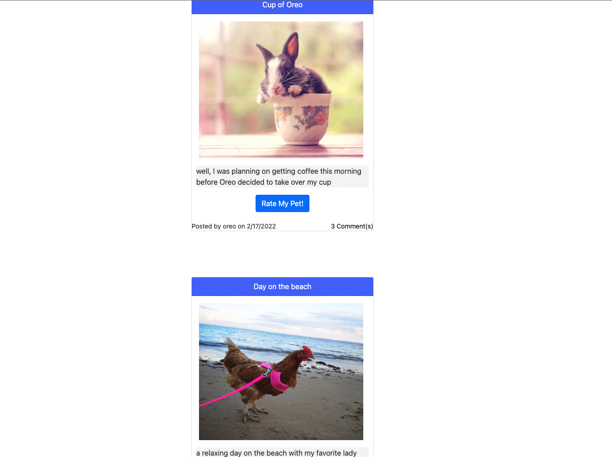

# We Rate Pets! 🐩 🐈 🐣 🐇
- Full Stack application where Users can `Share` | `Comment` | `Connect` with Pet Lovers from all over the world 🌐

## Deployment Link via Heroku 🔗
* [Heroku Link](https://infinite-sea-93313.herokuapp.com/)
* [Github Repo](https://github.com/jessebubble/we-rate-pets)

## Collaborators (Meet The Team) 🫡
- [Courtney Evins](https://github.com/coevpen)
- [Margaret Barrera](https://github.com/mlbarre)
- [Jesse Hernandez](https://github.com/jessebubble)

## Description 📓
- We Rate Pets is a Social Media site built with modern Javascript | MongoDB | NodeJS/ExpressJS and more 
- Users can upload photos of their pets 
- Actively Engage with other Pet Lovers on the platform by leaving comments on post from the community

## Resources
* [NodeJS/ExpressJS](https://expressjs.com/)
* [MySQL](https://www.mysql.com/)
* [HandlebarsJS](https://handlebarsjs.com/)
* [Express Session](https://github.com/expressjs/session)
* [Deploy to Heroku](https://www.heroku.com/)

- This project also used a wide range of npm packages: (installing these packages require `npm install`)
    - ` Bcrypt `
    - ` Dotenv `
    - ` Connect-Session-Sequelize `
    - ` MySQL2 `
    - ` Sequelize ORM`

## Pending Updates 🔮
- Update CSS Styling 